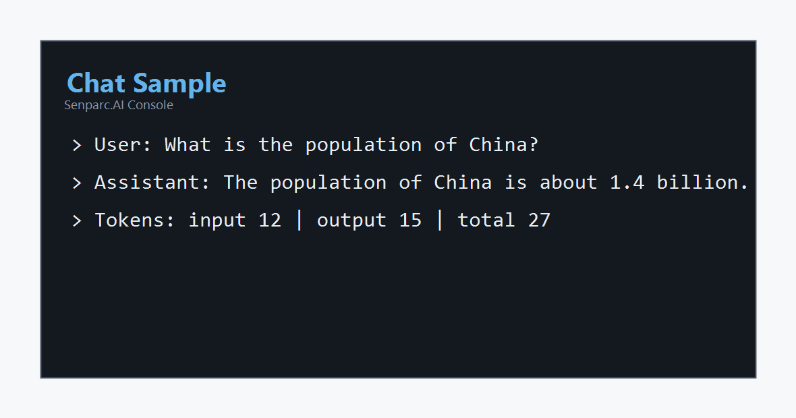
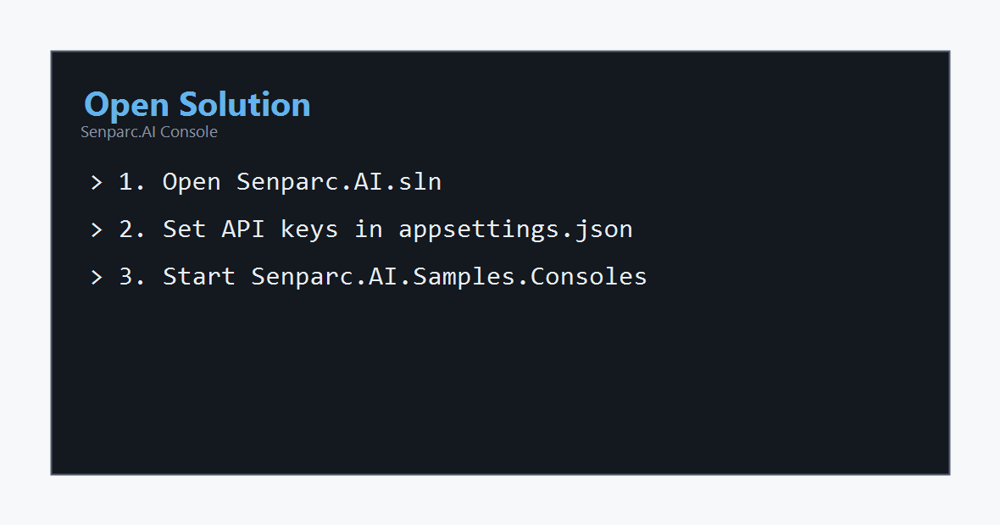
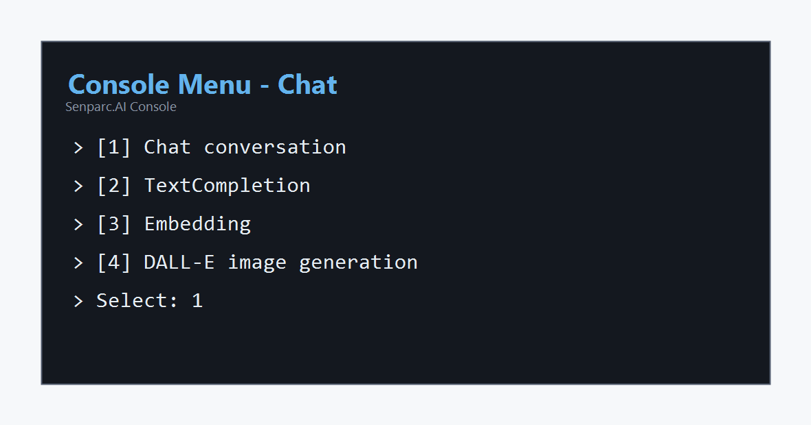
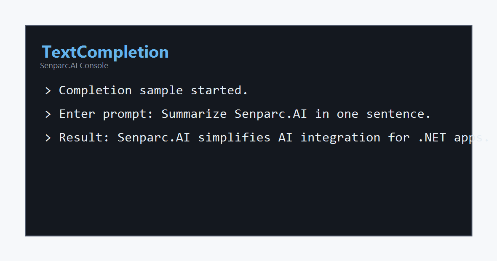
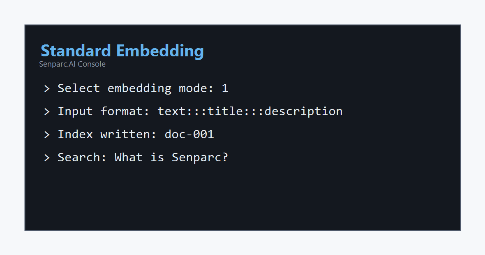
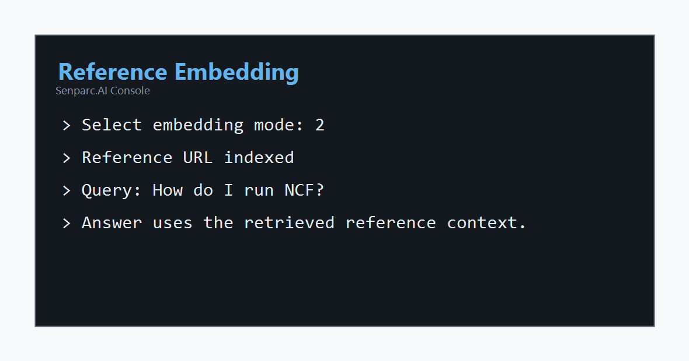
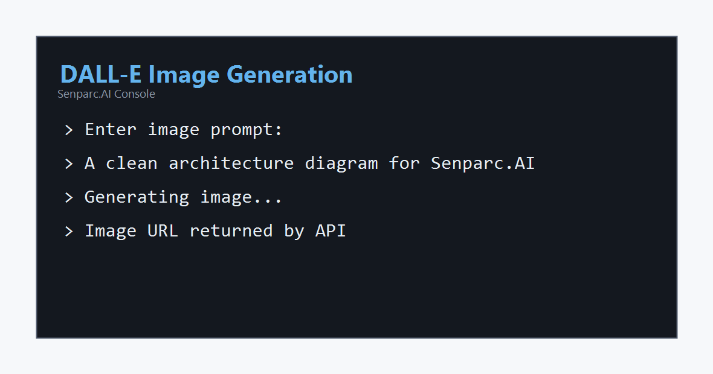
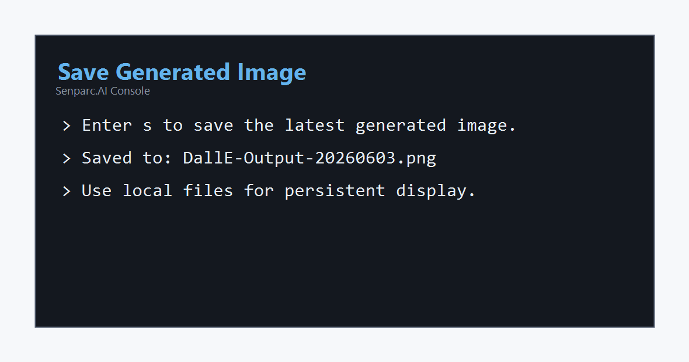
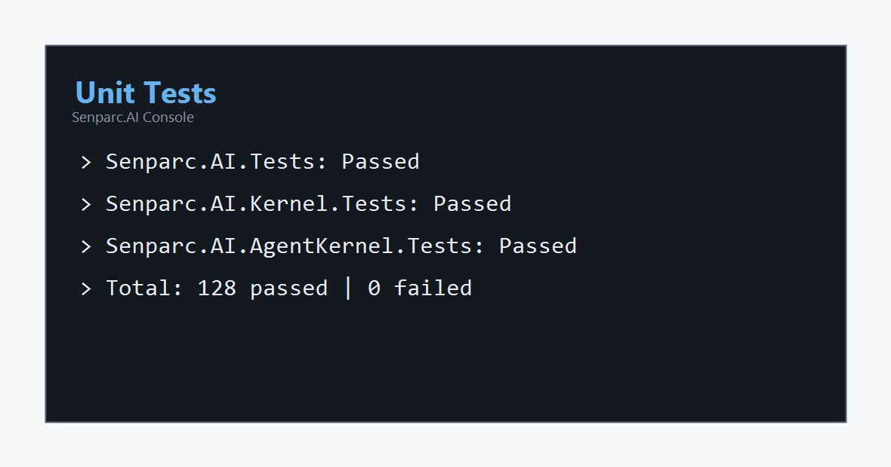

# Senparc.AI

Senparc.AI is the AI extension package for the Senparc ecosystem. It currently focuses on LLM interaction and provides shared .NET abstractions for chat, text completion, embeddings, speech, image generation, Semantic Kernel integration, Microsoft Agent Framework integration, and agent workflows.

## Project Overview

| Package | Description | NuGet |
| --- | --- | --- |
| `Senparc.AI` | Base module for all standard interfaces and shared capabilities. | [](https://www.nuget.org/packages/Senparc.AI/) |
| `Senparc.AI.AgentKernel` | Agent-oriented kernel built on the Senparc.AI standard. It wraps Microsoft Agent Framework and supports Chat, Embedding, TTS, STT, Image, vector storage, plugins, multiple model backends, and rapid agent application development. | [](https://www.nuget.org/packages/Senparc.AI.AgentKernel/) |
| `Senparc.AI.Kernel` | Semantic Kernel implementation of the Senparc.AI API surface. It is designed for plug-and-play integration. | [](https://www.nuget.org/packages/Senparc.AI.Kernel/) |
| `Senparc.AI.PromptRange` ([standalone project](https://github.com/Senparc/Senparc.AI.PromptRange)) | Base library that supports the PromptRange ecosystem through the Senparc.AI standard. It is implemented in [Senparc.Xncf.PromptRange](https://github.com/NeuCharFramework/NcfPackageSources/tree/master/src/Extensions/Senparc.Xncf.PromptRange), can be used to build PromptRange-based extension applications, and supports Web, desktop, and mobile systems on .NET 6.0 or later. [NeuCharFramework (NCF)](https://github.com/orgs/NeuCharFramework) integrates [Senparc.Xncf.PromptRange](https://github.com/NeuCharFramework/NcfPackageSources/tree/master/src/Extensions/Senparc.Xncf.PromptRange) by default, so it can be used directly without code changes. See [What is PromptRange?](https://github.com/Senparc/Senparc.AI.PromptRange/wiki/What's-PromptRange%3F). | |
| `Senparc.AI.Agents` | Agent integration extension module implemented with [AutoGen](https://github.com/microsoft/autogen). | [](https://www.nuget.org/packages/Senparc.AI.Agents/) |

## Development Workflow

### Step 1: Configure An Account

Configure OpenAI, Azure OpenAI, NeuCharAI, HuggingFace, FastAPI, or another supported AI platform in `appsettings.json`.

```jsonc
// Senparc.AI settings
"SenparcAiSetting": {
  "IsDebug": true,
  "AiPlatform": "NeuCharAI", // Change this to the enum value for your platform.
  "NeuCharAIKeys": {
    "ApiKey": "<Your ApiKey>", // Apply at https://www.neuchar.com/Developer/AiApp.
    "NeuCharEndpoint": "https://www.neuchar.com/<DeveloperId>", // DeveloperId is visible when viewing the ApiKey.
    "ModelName": {
      "Chat": "gpt-4o",
      "Embedding": "text-embedding-ada-002",
      "EmbeddingDimensions": 1536,
      "TextCompletion": "gpt-4o-instruct",
      "SpeechToText": "whisper",
      "TextToSpeech": "tts"
    }
  },
  "AzureOpenAIKeys": {
    "ApiKey": "<Your AzureApiKey>",
    "AzureEndpoint": "<Your AzureEndPoint>", // https://xxxx.openai.azure.com/
    "AzureOpenAIApiVersion": "2022-12-01", // Quotas and limits: https://learn.microsoft.com/en-us/azure/cognitive-services/openai/quotas-limits
    "ModelName": {
      "Chat": "gpt-35-turbo"
    }
  },
  "OpenAIKeys": {
    "ApiKey": "<Your OpenAIKey>",
    "OrganizationId": "<Your OpenAIOrgId>",
    "OpenAIEndpoint": null,
    "ModelName": {
      "Chat": "gpt-35-turbo"
    }
  },
  "HuggingFaceKeys": {
    "Endpoint": "<Your EndPoint>", // HuggingFace endpoint
    "ModelName": {
      "TextCompletion": "chatglm2"
    }
  },
  "Items": {
    // Additional custom configuration
  }
}
```

The configuration above works as follows:

- `AiPlatform` selects the active platform. Supported values include:
  - `OpenAI`: the official openai.com API.
  - `NeuCharAI`: the Senparc relay API at https://www.neuchar.com.
  - `AzureOpenAI`: Microsoft Azure OpenAI Service.
  - `HuggingFace`: HuggingFace API.
  - `FastAPI`: FastAPI endpoint.
- The system switches the platform automatically based on `AiPlatform`; application logic does not need provider-specific branching.
- Configure `OpenAIKeys` only when `AiPlatform` is `OpenAI`.
- Configure `NeuCharAIKeys` only when `AiPlatform` is `NeuCharAI`.
- Configure `AzureOpenAIKeys` only when `AiPlatform` is `AzureOpenAI`.
- Other platform types follow the same pattern.
- Each platform configuration includes a `ModelName` node. Use it to specify the model for each capability. For example, set `"Chat": "gpt-4"` to use GPT-4 for chat.

Rate-limit references:

- Azure OpenAI quotas and limits: <https://learn.microsoft.com/en-us/azure/cognitive-services/openai/quotas-limits>
- OpenAI rate limits: <https://platform.openai.com/docs/guides/rate-limits>

#### Advanced 1: Configure A Multi-Model Environment

Use separate platform key blocks and `ModelName` values when one application needs different providers or different models for Chat, Embedding, TextCompletion, SpeechToText, TextToSpeech, or image generation.

#### Advanced 2: Dynamically Configure Model Parameters

Model parameters can be supplied at runtime through the request and handler configuration APIs, allowing different users, conversations, or workloads to use different model settings without changing the static `appsettings.json` file.

### Step 2: Develop

Senparc.AI uses a conversational programming style. You do not need to learn every platform SDK in detail. Define what you want to do, configure the model, build the kernel, then run the request. The following chat example shows the basic flow:

```csharp
// Read the AI model configuration automatically from appsettings.json.
var aiSetting = Senparc.AI.Config.SenparcAiSetting;

// Create the AI handler. This can also be supplied by dependency injection.
var handler = new SemanticAiHandler(aiSetting);

// Define AI call parameters and token limits.
var promptParameter = new PromptConfigParameter
{
    MaxTokens = 2000,
    Temperature = 0.7,
    TopP = 0.5,
};

// Prepare the runtime.
var userId = "JeffreySu"; // Used to distinguish users.
var iWantToRun =
    handler.IWantTo()
           .ConfigModel(ConfigModel.Chat, userId)
           .BuildKernel()
           .RegisterSemanticFunction("ChatBot", "Chat", promptParameter)
           .iWantToRun;

// Ask a question and get the result.
var prompt = "What is the population of China?";
var aiRequest = iWantToRun.CreateRequest(prompt, true, true);
var aiResult = await iWantToRun.RunAsync(aiRequest);
// aiResult.Result example: China has a population of about 1.4 billion.
```



## Samples

All quick-reference samples are located in the `/Samples/` folder.

| Folder | Description |
| --- | --- |
| `Samples/Senparc.AI.Samples.AgentKernelConsoles` | AgentKernel command-line sample. |
| `Samples/Senparc.AI.Samples.Consoles` | Command-line sample. |
| `Samples/Senparc.AI.Samples.Agents` | Agent sample with AutoGen integration. |

## Console Sample Usage

### 1. Open The Solution

Open `Senparc.AI.sln`, set the API key and platform parameters in `appsettings.json`, then start the `Senparc.AI.Samples.Consoles` project.



### 2. Operations

#### 2.1 Chat

Enter `1` to start the chat workflow.



#### 2.2 TextCompletion

Enter `2` on the main screen to start the TextCompletion workflow.



#### 2.3 Embedding

Enter `3` on the main screen to start the Embedding workflow. Embedding supports two categories: standard information and reference information. Select one in the next step.

##### 2.3.1 Standard Embedding Information

Select `1` to enter the standard Embedding test. Input information is separated by three English colons. After entering the information, enter `n` to start the chat test.



##### 2.3.2 Reference Embedding Information

Select `2` to enter the reference Embedding test. Input information is separated by three English colons. After entering the information, enter `n` to start the chat test.



#### 2.4 DALL-E Image Generation

Enter `4` on the main screen to start the DALL-E image generation workflow.



The result is returned as a URL. Enter `s` to save the generated image locally.



Note: the URL returned by the API is temporary and should not be used as a persistent display URL. Save the image promptly if you need to keep it.

## Unit Tests



## TODO

1. [x] Implement more model and mode matching scenarios.
2. [x] Implement fully automatic factory module configuration.
3. [x] Integrate with [Senparc.Weixin SDK](https://github.com/JeffreySu/WeiXinMPSDK) so AI capabilities can be added with no logic-code changes, mainly for chat scenarios.
4. [x] Integrate with [NeuCharFramework](https://github.com/NeuCharFramework/NCF) so AI capabilities can be added with no logic-code changes, mainly for development and cloud operation scenarios.
5. [x] Complete more default model adapters. Custom extension capability is already available.
6. [ ] Improve standalone documentation.
